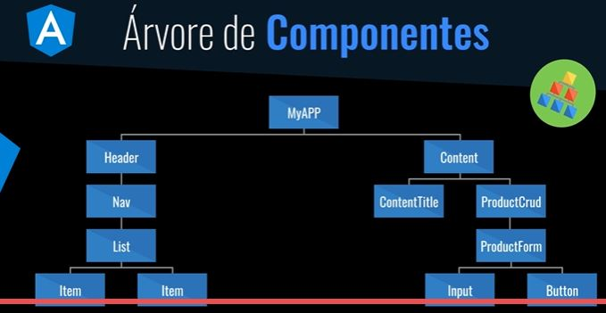
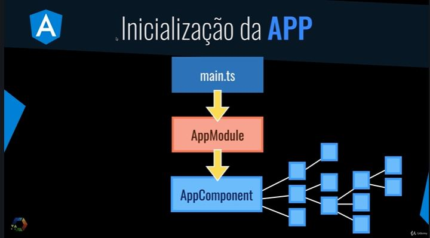
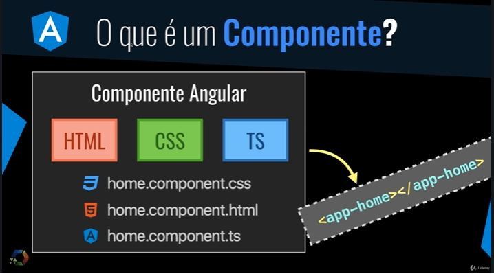
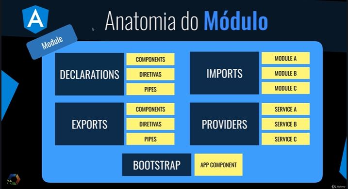
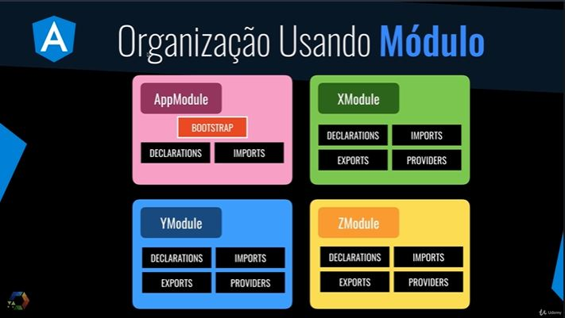

# angular-9-material-essencial
Projeto CRUD usando Anuglar 9 com material e  JSON server para simular um backend

### Backend

O foco não é backend então será criado um projeto sim na pasta backend, vamos iniciar um package npm, e em seguida
vamos instalar a dependencia do JSON server.
``` npm init -y ```
``` npm i json-server ```

Em seguida vamos criar o arquivo *db.json", basicamente o que o JSON Server faz lêr um arquivo json e cria uma api baseada nesse arquivo.

No arquivo *package.json* vamos adicionar um script para que o JSON server 
utilize o arquivo *bd.json*, e inicie na porta 3001.

```
  "scripts": {
    "start":"json-server --watch db.json --port 3001"
  },
```

### FrontEnd
#### Angular 9



##### Conceitos Essenciais

Fluxo de Inicialização de uma Aplicação em Angular



O que é componente?





##### Vamos começar, ta na hora do Hands On

1) O primeiro passo para criar um projeto Angular é instalar uma dependencia do node para o angular cli.

``` npm i -g @angular/cli ```

2) Criação do projeto angular

``` ng new frontend --minimal ```

3) Iniciar o projeto, na pasta frontend

``` npm start ```

Para atender a imagem acima de *componentes* onde queremos que cada componente tenha seu html e css em arquivos separados vamos fazer a seguinte alteração no arquivo *angular.json*, inlineTemplate e inlineStyle terão valor file e false

``` inlineTemplate: false, inlineStyle: false ``` 

4) Como estamos não estamos trabalhando com inline, vamos remover apptemplate do *app.components.ts" já que não queremos o conteúdo html e css dentro do typescript e vamos criar um novo arquivo chamado *app.component.html* e fazer referência a esse arquivo através da sintaxe abaixo:

``` templateUrl: 'app.component.html' ```

5) Instalando o Material Design e Componentes

5.1) Instação

``` ng add @angular/material ```

5.2) Criação do componente Header

Para criação de um componente no angular, vamos utilizar o comando *ng generate component* para criação do componente header.

``` ng g c components/template/header ```


5.3) Criação do componente Footer

``` ng g c components/template/footer ```


5.3) Criação do componente nav, para o componente nav vamos utilizar dois componentes do material (sidenav e list), lembrando que esses componentes precisam ser importados no *app.modude.ts*

``` ng g c components/template/nav ```

``` import { MatSidenavModule } from '@angular/material/sidenav'; import { MatListModule } from '@angular/material/list ```

5.4) Criação do component Inicio(Home), até agora estavamos criando os componentes na pasta *componentes/templates* que estão trechos de componentes reutilizados que possam ser utilizados em mais de uma tela. Porém, quando se tratar de uma tela inteira vamos criar nossos componentes na pasta *views*

``` ng g c views/home/ ``` 

5.5) Criação do componentes de cadastro de produtos. Vamos tentar componetizar o máximo os componentes necessários para um CRUD de cadastro. 

``` ng g c views/product-crud/ ``` 